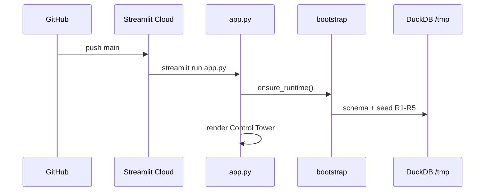

# Deploy Guide · Gêmeo Digital de Varejo

Instruções para **GitHub**, **setup local** e **Streamlit Community Cloud**.

---

## 1. Publicar no GitHub

```bash
cd project
git init
git add .
git commit -m "feat: Gêmeo Digital supply chain tower — production ready"
git branch -M main
git remote add origin https://github.com/SEU_USUARIO/gemeo-digital-varejo.git
git push -u origin main
```

### O que NÃO commitar

- `.env`, `.streamlit/secrets.toml`
- `data/*.duckdb`, Parquet gerados
- `logs/`, `models/artifacts/` (opcional)

O `.gitignore` já cobre esses paths.

---

## 2. Streamlit Cloud

### Passo a passo

1. Acesse [https://share.streamlit.io](https://share.streamlit.io)
2. **Create app** → conecte o repositório GitHub
3. Configure:

| Campo | Valor |
|-------|-------|
| **Branch** | `main` |
| **Main file path** | `app.py` |
| **App URL** | `gemeo-digital` (ou nome desejado) |

Se o repositório tiver estrutura `MVP-gemeos/project/`, defina:

| Campo | Valor |
|-------|-------|
| **Root directory** | `project` |

4. **Advanced settings → Secrets** — cole:

```toml
GROQ_API_KEY = "gsk_sua_chave_aqui"
GROQ_MODEL = "llama-3.3-70b-versatile"

TWIN_ENV = "production"
TWIN_LIGHT_SEED = "true"
TWIN_SEED_HISTORY_DAYS = "21"
TWIN_SEED_N_SKUS = "96"

DUCKDB_PATH = "/tmp/warehouse.duckdb"
DUCKDB_THREADS = "2"
DUCKDB_MEMORY_LIMIT = "2GB"

LOG_LEVEL = "INFO"
```

5. **Deploy**

### Primeiro boot na nuvem

- O runtime detecta Streamlit Cloud e ativa **light seed** automaticamente
- Schema DuckDB + dados sintéticos R1–R5 são criados em `/tmp`
- Tempo estimado: **1–3 minutos** na primeira visita
- Visitas seguintes reutilizam o warehouse da sessão (ephemeral)

### Groq sem API key

A plataforma funciona **offline** para ML e dashboards. Apenas a camada AI Interpreter fica desabilitada.

---

## 3. Setup local (desenvolvimento)

```bash
python -m venv .venv
.venv\Scripts\activate          # Windows
pip install -r requirements.txt
cp .env.example .env
python scripts/bootstrap.py --force --full
streamlit run app.py
```

### Perfil full vs light

| Perfil | `TWIN_LIGHT_SEED` | SKUs | Dias | Uso |
|--------|-----------------|------|------|-----|
| Full | `false` | 240 | 60 | Dev local, treino ML |
| Light | `true` | 96 | 21 | Cloud, demos rápidas |

---

## 4. Validação pré-deploy

```bash
python scripts/validate.py
pytest -q
```

Saída esperada: todos os checks com `✓`.

---

## 5. Treinar modelos (opcional)

```bash
python scripts/train_rupture_models.py
# ou via UI: ML Operations Center → Treinar R1–R5
```

Artefatos: `models/artifacts/R*/`

---

## 6. Troubleshooting

| Sintoma | Solução |
|---------|---------|
| Boot lento na Cloud | Normal no 1º acesso; `TWIN_LIGHT_SEED=true` |
| `warehouse.duckdb` locked | Reinicie app; Cloud usa `/tmp` |
| AI offline | Configure `GROQ_API_KEY` em Secrets |
| Página em branco | System Console → Recarregar warehouse |
| ML sem scores | ML Ops → Treinar modelos |

---

## 7. Diagrama de deploy



---

## Checklist de produção

- [ ] `requirements.txt` commitado
- [ ] Secrets configurados na Cloud
- [ ] `python scripts/validate.py` passa
- [ ] `GROQ_API_KEY` (se AI necessária)
- [ ] Root directory correto no painel Streamlit
- [ ] README e favicon visíveis
