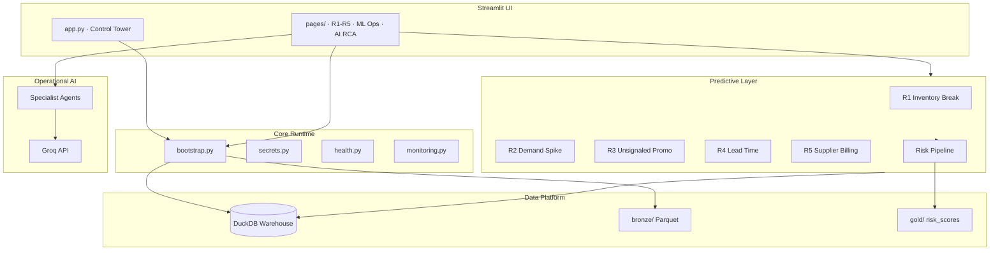

# Gêmeo Digital de Varejo

**Operational Intelligence Platform** para prevenção de ruptura em supply chain de supermercados.

Plataforma enterprise de observabilidade operacional, inteligência preditiva (5 rupturas críticas R1–R5), simulação de gêmeo digital e interpretação executiva via Groq — **sem depender de banco pago**.

[](https://streamlit.io)
[](https://python.org)
[](https://duckdb.org)

---

## Visão executiva

| Capacidade | Descrição |
|------------|-----------|
| **Torre de Controle** | KPIs de rede, health score, alertas operacionais |
| **5 Rupturas ML** | R1 Inventário · R2 Demanda · R3 Promoção · R4 Lead Time · R5 Fornecedor |
| **SHAP Explainability** | Drivers causais com impacto percentual |
| **AI Interpreter** | Groq explica scores — não prevê, interpreta |
| **Simulação** | Motor de eventos discretos + what-if |
| **Medallion Lake** | Bronze / Silver / Gold em Parquet (zstd) |

---

## Documentação

Guia detalhado em **[docs/](docs/)** — visão geral, arquitetura, catálogo R1–R5, pipeline ML, features, SHAP, dados, Groq e glossário.

---

## Arquitetura



### Camadas

1. **UI** — Streamlit multipage, tema dark enterprise, componentes reutilizáveis
2. **Services** — fronteira entre UI e domínio (`services/`)
3. **Models** — XGBoost + LightGBM ensemble por ruptura (`models/r*/`)
4. **Agents** — roteamento de intenção + dossier DuckDB + Groq (`agents/`)
5. **Data** — DuckDB OLAP local + lake Parquet (`database/`, `data/`)

---

## Stack

| Camada | Tecnologia |
|--------|------------|
| UI | Streamlit 1.41 |
| Warehouse | DuckDB 1.1 |
| Lake | Parquet (zstd) |
| ML | XGBoost, LightGBM, SHAP |
| Viz | Plotly |
| LLM | Groq (`llama-3.3-70b-versatile`) |
| Python | 3.11+ |

---

## Setup local

### Pré-requisitos

- Python **3.11+**
- Git

### Instalação

```bash
cd project
python -m venv .venv

# Windows
.venv\Scripts\activate

# macOS / Linux
source .venv/bin/activate

pip install -r requirements.txt
cp .env.example .env
# Opcional: GROQ_API_KEY=gsk_...
```

### Bootstrap completo

```bash
python scripts/bootstrap.py --force
# ou perfil completo (60d, 240 SKUs):
python scripts/bootstrap.py --force --full
# com treino ML:
python scripts/bootstrap.py --force --full --train
```

### Executar

```bash
streamlit run app.py
# ou
make run
```

Acesse: **http://localhost:8501**

---

## Deploy · Streamlit Cloud

Guia detalhado: **[DEPLOY.md](DEPLOY.md)**

### Resumo

1. Push do diretório `project/` para GitHub
2. [share.streamlit.io](https://share.streamlit.io) → **New app**
3. **Main file path:** `app.py`
4. **Root directory:** `project` (se o repo tiver pasta pai)
5. **Secrets** (Settings → Secrets):

```toml
GROQ_API_KEY = "gsk_..."
TWIN_LIGHT_SEED = "true"
DUCKDB_PATH = "/tmp/warehouse.duckdb"
DUCKDB_THREADS = "2"
DUCKDB_MEMORY_LIMIT = "2GB"
```

6. Deploy — o primeiro boot gera dados sintéticos automaticamente (~1–3 min)

---

## Scripts

| Script | Função |
|--------|--------|
| `scripts/bootstrap.py` | Schema + seed + validação (+ `--train`) |
| `scripts/init.py` | Init rápido (light seed) |
| `scripts/validate.py` | Suite de validação pré-deploy |
| `scripts/generate_world.py` | Gerador de mundo completo (Parquet) |
| `scripts/train_rupture_models.py` | Treino R1–R5 |
| `scripts/verify_rupture_seed.py` | Verifica assinaturas R1–R5 no warehouse |

---

## Estrutura do repositório

```
project/
├── app.py                 # Entry point · Control Tower
├── pages/                 # Módulos Streamlit
├── core/                  # Bootstrap, secrets, health, errors
├── models/                # ML R1–R5 + shared pipeline
├── agents/                # Groq + specialist agents
├── services/              # Service layer
├── database/              # DuckDB schema, seed, queries
├── simulation/            # Digital twin engine
├── components/            # UI primitives
├── assets/                # CSS, favicon, branding
├── scripts/               # CLI tooling
├── data/                  # warehouse + lake (gitignored)
├── .streamlit/            # config.toml + secrets example
└── requirements.txt
```

---

## Variáveis de ambiente

| Variável | Default | Descrição |
|----------|---------|-----------|
| `GROQ_API_KEY` | — | API Groq (opcional) |
| `TWIN_LIGHT_SEED` | `false` | Seed reduzido (Cloud: `true`) |
| `TWIN_SEED_HISTORY_DAYS` | `60` | Dias de histórico sintético |
| `TWIN_SEED_N_SKUS` | `240` | SKUs no catálogo |
| `DUCKDB_PATH` | `./data/warehouse.duckdb` | Caminho do warehouse |
| `LOG_LEVEL` | `INFO` | Nível de log |

---

## Rupturas monitoradas

| Código | Nome | Output ML |
|--------|------|-----------|
| R1 | Quebra de Inventário | `inventory_break_risk` |
| R2 | Venda Acima da Média | `above_average_sales_risk` |
| R3 | Promoção Não Sinalizada | `unsignaled_promotion_risk` |
| R4 | Lead Time / Entrega | `purchase_delivery_risk` |
| R5 | Restrição Faturamento | `supplier_billing_restriction_risk` |

---

## Testes

```bash
pytest -q
python scripts/validate.py
```

---

## Licença

Projeto de demonstração / portfolio. Uso corporativo sujeito a licenciamento.

---

**Gêmeo Digital de Varejo** · Operational Intelligence · Supply Chain Tower
